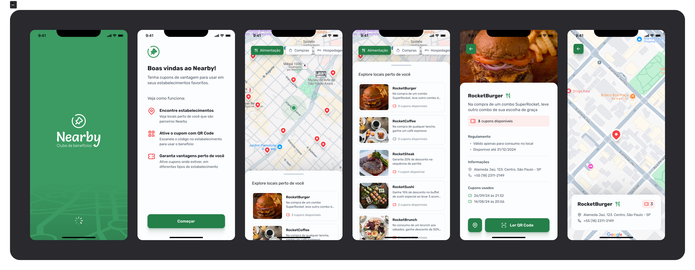

<h1 align="center">Nearby App</h1>

<p align="center">
Descubra benefícios e cupons em estabelecimentos próximos de você!
</p>

<p align="center">
  <a href="#-tecnologias">Tecnologias</a>&nbsp;&nbsp;&nbsp;|&nbsp;&nbsp;&nbsp;
  <a href="#-projeto">Projeto</a>&nbsp;&nbsp;&nbsp;|&nbsp;&nbsp;&nbsp;
  <a href="#-layout">Layout</a>&nbsp;&nbsp;&nbsp;|&nbsp;&nbsp;&nbsp;
  <a href="#-instalação-e-uso">Instalação</a>&nbsp;&nbsp;&nbsp;|&nbsp;&nbsp;&nbsp;
  <a href="#memo-licença">Licença</a>
</p>

<p align="center">
  
</p>

<br>



## 🚀 Tecnologias

Esse projeto foi desenvolvido com as seguintes tecnologias:

- React Native
- Expo
- Typescript
- Axios
- Node
- SQlite
- Prisma
- Zod
- Express

## 💻 Projeto

Nearby é um aplicativo mobile criado no evento NLW Pocket da Rocketseat.
O app atua como um clube de benefícios, permitindo que usuários descubram estabelecimentos próximos e aproveitem cupons exclusivos.

Construído com React Native e Expo, o app utiliza geolocalização para oferecer uma experiência prática, moderna e interativa.

## 🎨 Layout

https://www.figma.com/community/file/1448070647757721748

## 🚀 Instalação e uso

```bash
# Clone o repositório
git clone git@github.com:viniciussgp/nearby-app.git

# Acesse a pasta do projeto
cd nearby-app

# Instale as dependências
npm i

# Execute a aplicação
npm run start
```

## 📝 License

Este projeto está licenciado sob a Licença MIT. Veja o arquivo [LICENSE](LICENSE) para obter mais detalhes.

---

Feito com 💜 por [Vinícius Alves](https://github.com/viniciussgp)
